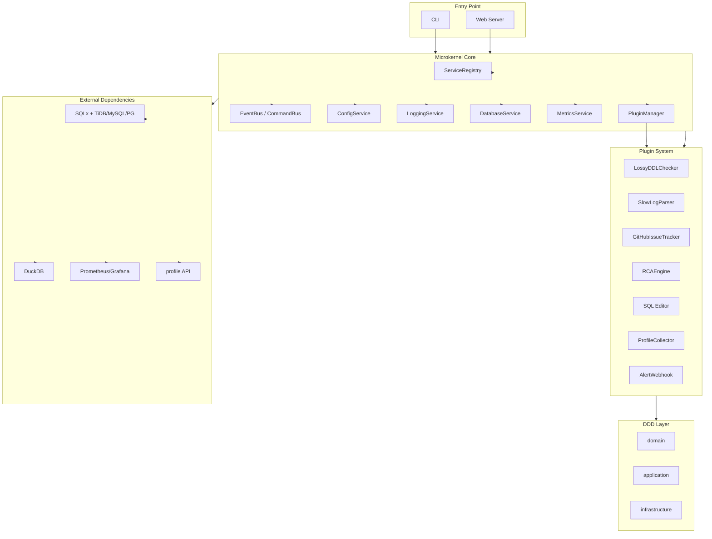

# TiDB Intelligent Health Check (tihc)

[Online Docs](https://www.askaric.com/en/tihc/)

---

## Overview

TiHC is an **intelligent health check platform** for TiDB, designed for DBAs and developers. It provides CLI and Web UI for cluster inspection, slow query analysis, DDL safety checks, GitHub issue tracking, alerting, and more. The system is built on a microkernel architecture with plugin-based extensibility.

---

## Architecture Highlights

- **Microkernel Core**: Manages plugin lifecycle, service registry, event bus, and core services (config, logging, DB, metrics).
- **Plugin System**: All business logic is implemented as plugins (DDD bounded contexts). Plugins communicate via ServiceRegistry and EventBus.
- **Frontend**: Vue 3 + TypeScript + Naive UI + Vue Naive Admin for rapid admin UI development.
- **Backend**: Rust (axum, sqlx, DuckDB, Prometheus client, tracing, anyhow, thiserror).

### Architecture Diagram


#### Text Version (Layered Structure)

```
+-----------------------------------------------------+
|                 CLI / Web Server Entry Point        |
+-----------------------------------------------------+
|              🌐 Microkernel Core                    |
| +-----------------------------------------------+ |
| | Core Services                                 | |
| | - ConfigService                               | |
| | - LoggingService (tracing)                    | |
| | - DatabaseService (SQLx)                      | |
| | - MetricsService (Prometheus)                 | |
| | - EventBus / CommandBus                       | |
| | - ServiceRegistry (Plugin Service Registry)   | |
| +-----------------------------------------------+ |
| | Plugin Management (PluginManager)             | |
| | - Plugin discovery/loading/lifecycle mgmt     | |
| | - Plugin hot-reload (future)                  | |
| +-----------------------------------------------+ |
+-----------------------------------------------------+
|                📦 Plugin System (DDD Context)      |
| Plugin = Bounded Context, each plugin encapsulates its own domain and services |
| +-------------------------------------------------+ |
| | LossyDDLChecker       | Diagnose lossy DDL risks  | |
| | SlowLogParser         | Parse slow.log and import | |
| | GitHubIssueTracker    | GitHub issue mapping      | |
| | RCAEngine             | Root cause analysis (AWR/ADDM) | |
| | SQL Editor            | Visual SQL editor         | |
| | ProfileCollector      | Profile & metrics capture | |
| | AlertWebhook          | Alert push & config       | |
| +-------------------------------------------------+ |
+-----------------------------------------------------+
|              🧠 DDD Layer Structure in Each Plugin  |
| +-----------------------------------------------+ |
| | domain         | Domain model/rules/entities/events| |
| | application    | Use case layer/domain service coordination | |
| | infrastructure | DB/HTTP/Prometheus implementation| |
| +-----------------------------------------------+ |
+-----------------------------------------------------+
|             📡 External Dependencies/Data Sources (Unified Adapter) |
| +-------------------------------------------------+ |
| | SQLx + TiDB / MySQL / PG                        | |
| | DuckDB embedded analytics DB                    | |
| | Prometheus / Grafana HTTP API                   | |
| | profile API capture (tidb/tikv/pd/ticdc)        | |
| +-------------------------------------------------+ |
```


#### Mermaid Version (graph TD)



---

## Quick Start

### 🚀 Universal One-line Installation (Recommended)

```bash
curl -fsSL https://raw.githubusercontent.com/AricSu/tihc/main/scripts/universal-install.sh | bash
```

**Supports:** Linux, macOS, Windows (WSL) - automatically detects your platform!

### 📦 Manual Installation

Download the latest release for your platform:

- [Linux x86_64](https://github.com/AricSu/tihc/releases/latest)
- [macOS x86_64 (Intel)](https://github.com/AricSu/tihc/releases/latest) 
- [macOS ARM64 (Apple Silicon)](https://github.com/AricSu/tihc/releases/latest)

### 🔨 Build from Source

```bash
git clone https://github.com/AricSu/tihc.git
cd tihc
make server
./bin/tihc --help
```

---

## Key Features

- **Database Management**: Create, view, and delete databases.
- **Table & Column Management**: Inspect table structure, add/remove columns.
- **SQL Execution**: Run queries, view results, manage history.
- **Slow Log Analysis**: Import and analyze TiDB/MySQL slow logs.
- **DDL Safety Check**: Diagnose risky DDL changes.
- **GitHub Issue Tracker**: Map and analyze issues for TiDB.
- **Profile Collection**: Capture and visualize flamegraphs.
- **Alert Webhook**: Configure alert channels and rules.
- **Real-time Notifications**: SSE push for SQL execution progress.

---

## Technology Stack

| Layer      | Technology                                    |
|-----------|-----------------------------------------------|
| Frontend   | Vue 3, Vite, TypeScript, Pinia, Naive UI, ECharts, Vue Naive Admin |
| Backend    | Rust, axum, sqlx, DuckDB, Prometheus client, tracing, anyhow, thiserror |
| Plugin     | DDD + Clean Architecture, ServiceRegistry, EventBus |

---

## Directory Structure

```
tihc/
├── Cargo.toml                 # Rust workspace config
├── cli/                       # CLI launcher
├── core/                      # Microkernel, DDD, plugin framework
├── plugins/                   # Plugin collection (each as a crate)
├── backend/                   # Web service launcher (REST API)
├── frontend/                  # Vue 3 frontend (admin UI)
├── common/                    # Shared utilities
├── scripts/                   # Build/release/migration scripts
├── docs/                      # Design docs, API specs
```

---

## Development & Contribution

- All backend modules use Rust, follow DDD and microkernel principles.
- Frontend uses Vue Naive Admin syntax and components for all admin UI logic. Any non-compliant code should be refactored to use Vue Naive Admin.
- Plugins are independent crates, each with domain/application/infrastructure layers.
- All code must use English for comments and documentation. See `/docs/design/tihc-core design.md` for doc style.
- For API details and usage, see [Online Docs](https://www.askaric.com/en/tihc/).

### Supported Platforms

- **Linux x86_64** - Primary development and deployment platform
- **macOS x86_64** - Intel-based Mac development
- **macOS ARM64** - Apple Silicon Mac development

> **Note**: Windows and Linux ARM64 support are planned for future releases.

### Building from Source

```bash
# Clone the repository
git clone https://github.com/AricSu/tihc.git
cd tihc

# Build the CLI
make server

# The binary will be available at bin/tihc
./bin/tihc --help
```

---

## Documentation

- [Online Docs](https://www.askaric.com/en/tihc/)
- [Design Docs](/docs/design/)
- [API Reference](/docs/design/tihc-sql%20editor.md)

---

## License

MIT
