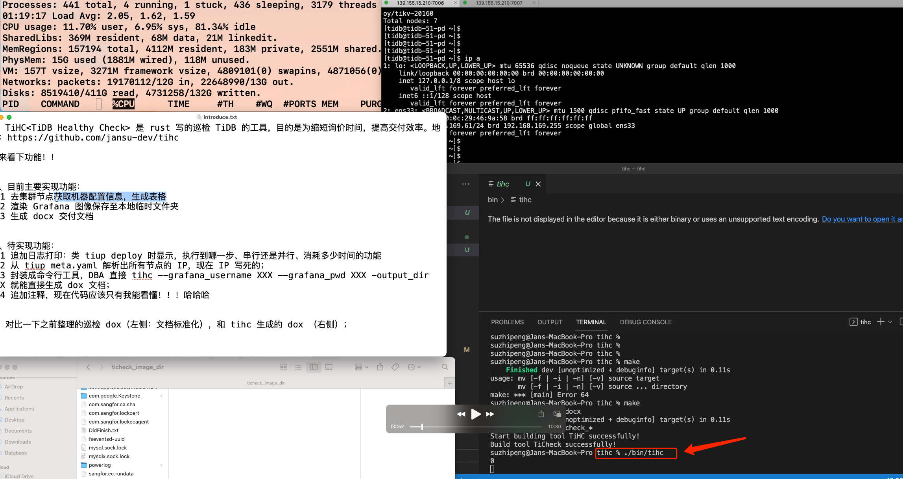
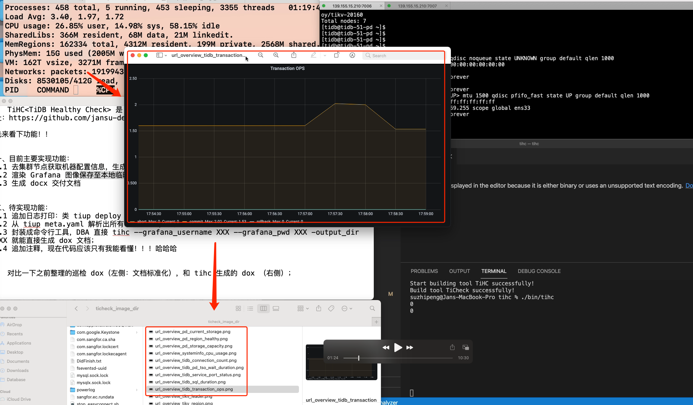
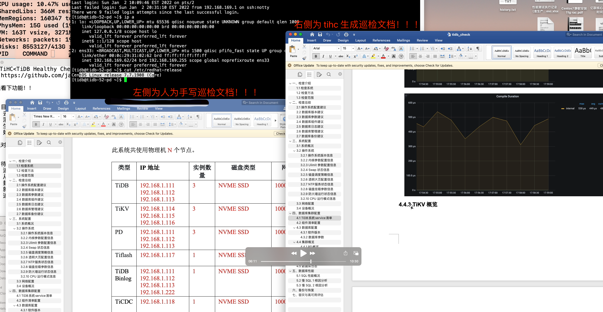
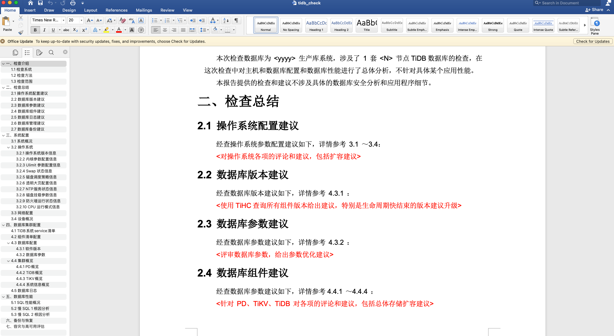

# TiHC
&nbsp;&nbsp;&nbsp;&nbsp;&nbsp;&nbsp;&nbsp;TiHC (TiDB Healthy Check) 是一个开源的、基于 rust 构建的 TiDB 巡检工具，目的是为缩短询价时间，提高交付效率。与传统 Oracle、MySQL 等巡检工具使用 SQL 采集对应内存表、操作系统指标，最终生成 Html 巡检报告不同。因为 TiDB 排查问题的方法论基于 Grafana 监控指标构建，tihc 借鉴 TiDB 官方工具 tiup 分发 ssh 的原理，分布式采集各节点信息并整合 grafana 监控，最终生成可交付的巡检 Office Doc 文件。

&nbsp;&nbsp;&nbsp;&nbsp;&nbsp;&nbsp;&nbsp;**TiHC 的作用**
&nbsp;&nbsp;&nbsp;&nbsp;&nbsp;&nbsp;&nbsp;1. 节约 TiDB 巡检过程中大量可模版化工作；
&nbsp;&nbsp;&nbsp;&nbsp;&nbsp;&nbsp;&nbsp;* 非常容易上手，如果你是一名 DBA（遵循 terminal tool 使用风格）；
&nbsp;&nbsp;&nbsp;&nbsp;&nbsp;&nbsp;&nbsp;* 对新手学习友好，如果你接触 TiDB 不久，提供一套基础 healthy check 思路判定当前集群是否健康；
# Features

* **采集 grafana 监控面板**
&nbsp;&nbsp;&nbsp;&nbsp;&nbsp;&nbsp;&nbsp;调用 grafana-image-render 插件，获取指定时间段内的监控信息。

* **生成 Docx 巡检文档**
&nbsp;&nbsp;&nbsp;&nbsp;&nbsp;&nbsp;&nbsp;TiHC 将手机上了的统计数据排版、生成 Office Word 文档模版，仅需少量修改便可直接交付客户。   

* **轻量化巡检采集操作**  
&nbsp;&nbsp;&nbsp;&nbsp;&nbsp;&nbsp;&nbsp;TiHC 只需初次巡检时，配置 Grafana-image-render 信息。此后，仅需要一个可执行文件便可完成全部巡检工作。


# Documents  

* 更多细节相见 Wiki

# Quick start
## 1. TiHC 使用简介


&nbsp;&nbsp;&nbsp;&nbsp;&nbsp;&nbsp;&nbsp;可 --help 或 -h 查看
```shell
$ tihc % ./bin/tihc -h
TiHC 1.0
Jan Su
TiHC (TiDB Healthy Check) is a tool designed by RUST to reduce inquiry time and improve delivery efficiency.

USAGE:
    tihc [OPTIONS]

FLAGS:
    -h, --help       Prints help information
    -v, --version    Print TiHC version

OPTIONS:
    -c <cluster_name>              The name of cluster which need to health check.
    -t <grafana_end_time>          The TSO of grafana end time which need to get images.
    -p <grafana_pwd>               Use password of target grafana. (default "admin")
    -f <grafana_start_time>        The TSO of grafana start time which need to get images.
    -u <grafana_user>              Use user name of target grafana. (default "admin")
    -P <ssh_pwd>                   The password to login via SSH with "ssh_user".
    -U <ssh_user>                  The user name to login via SSH.
```

该工具在获取 Grafana 监控面板图像部分，借用了 grafana-image-renderer 插件,具体使用方法参考 [Grafana Image Renderer](https://grafana.com/grafana/plugins/grafana-image-renderer/)  的 `Run as standalone Node.js application` 部分。


## 2. TiHC 源码编译


## 3. TiHC 快速巡检

 

 

 



## 2.2 如何手动 build TiHC？


```bash
# Get repo from github
git clone git@github.com:jansu-dev/tihc.git && cd tihc

# Build the tool by Makefile
make

# Get binary of tihc
ll ./bin/tihc
```


# 三、如何使用 TiHC？ 


Dependencies

This plugin is packaged in a single executable with Node.js runtime and Chromium browser. This means that you don't need to have Node.js and Chromium installed in your system for the plugin to function.

However, the Chromium browser depends on certain libraries. If you don't have all of those libraries installed in your system, you may see some errors when you try to render an image. For more information including troubleshooting help, refer to Grafana Image Rendering documentation.

Memory requirements

Rendering images requires a lot of memory, mainly because Grafana creates browser instances in the background for the actual rendering. We recommend a minimum of 16GB of free memory on the system rendering images.

Rendering multiple images in parallel requires an even bigger memory footprint. You can use the remote rendering service in order to render images on a remote system, so your local system resources are not affected.


```shell
./bin/tihc -c xu-tidb -u admin -p admin -U tidb -P tidb -f "2022-03-17 14:00:00" -t "2022-03-17 14:10:00"
```