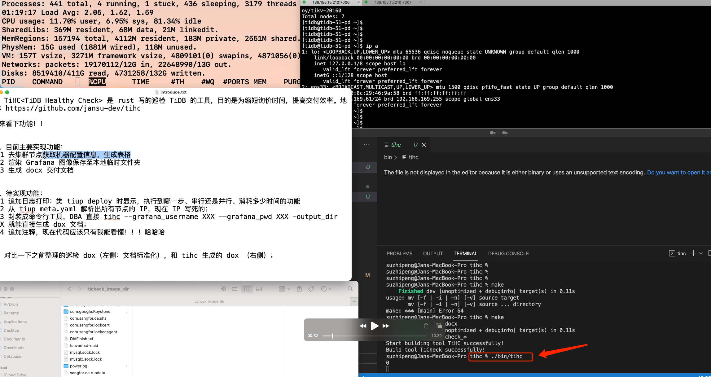
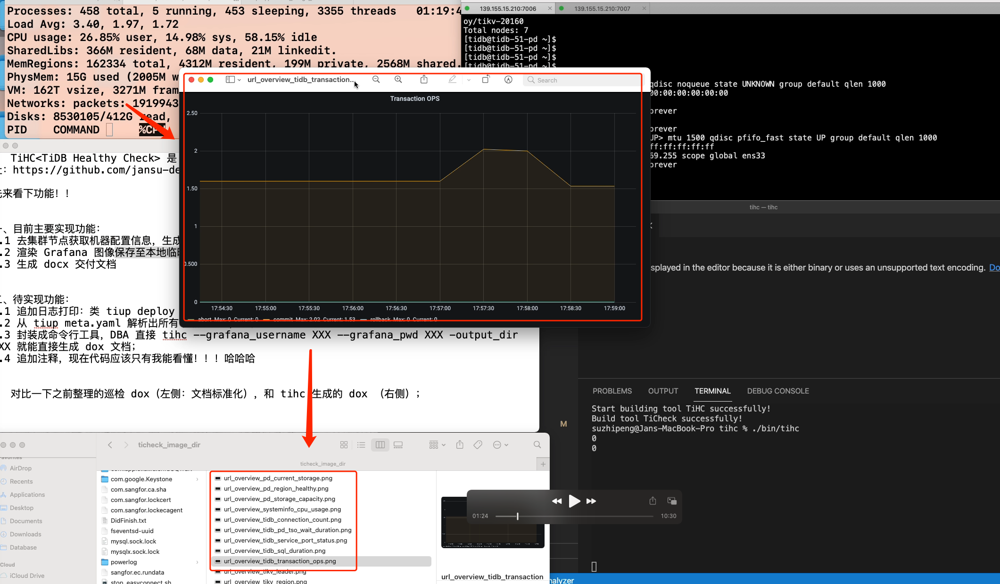
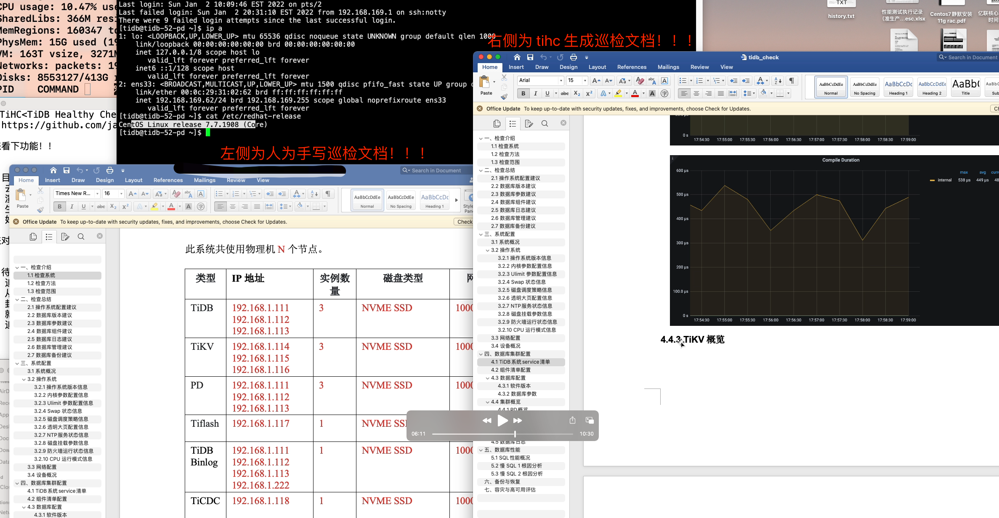
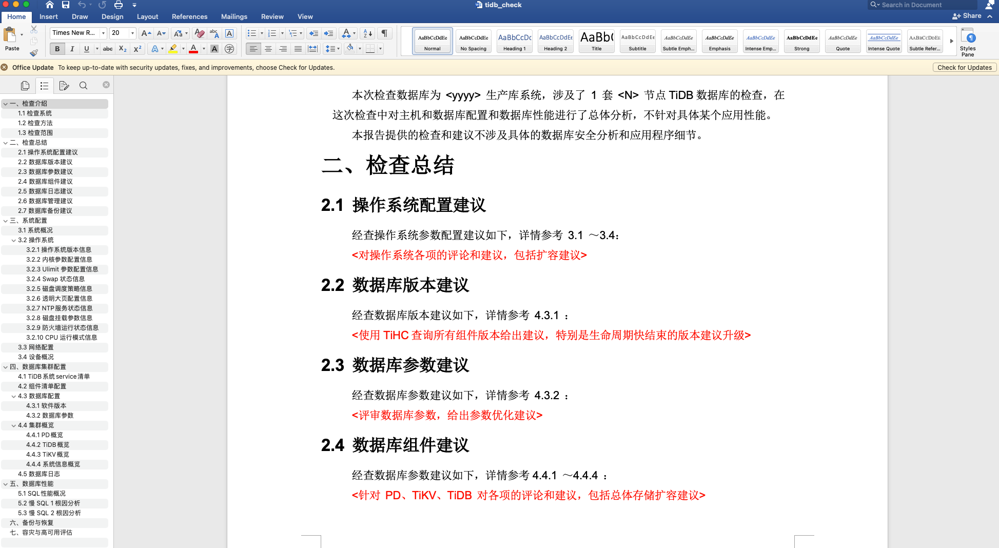

# 一、什么是 TiHC？
TiHC (TiDB Healthy Check) 是 rust 写的巡检 TiDB 的工具，目的是为缩短询价时间，提高交付效率。
* TiHC 可直接生成 Docx 巡检文档；


# 二、为什么需要 TiHC？
* 节约 TiDB 巡检过程中大量可模版化工作；
* 非常容易上手，如果你是一名 DBA（遵循 terminal tool 使用风格）；
* 对新手学习友好，如果你接触 TiDB 不久，提供一套基础 healthy check 思路判定当前集群是否健康；


## 2.1 如何获取 TiHC 报告？

 

 

 



## 2.2 如何手动 build TiHC？


```bash
# Get repo from github
git clone git@github.com:jansu-dev/tihc.git && cd tihc

# Build the tool by Makefile
make

# Get binary of tihc
ll ./bin/tihc
```


# 三、如何使用 TiHC？ 

```shell
$ tihc % ./bin/tihc -h
TiHC 1.0
Jan Su
TiHC (TiDB Healthy Check) is a tool designed by RUST to reduce inquiry time and improve delivery efficiency.

USAGE:
    tihc [OPTIONS]

FLAGS:
    -h, --help       Prints help information
    -v, --version    Print TiHC version

OPTIONS:
    -c <cluster_name>              The name of cluster which need to health check.
    -t <grafana_end_time>          The TSO of grafana end time which need to get images.
    -p <grafana_pwd>               Use password of target grafana. (default "admin")
    -f <grafana_start_time>        The TSO of grafana start time which need to get images.
    -u <grafana_user>              Use user name of target grafana. (default "admin")
    -k <key_file>                  The path to the SSH trust file used to connect nodes.
    -P <ssh_pwd>                   The password to login via SSH with "ssh_user".
    -U <ssh_user>                  The user name to login via SSH.
```

该工具在获取 Grafana 监控面板图像部分，借用了 grafana-image-renderer 插件,具体使用方法参考 [Grafana Image Renderer](https://grafana.com/grafana/plugins/grafana-image-renderer/)  的 `Run as standalone Node.js application` 部分。


