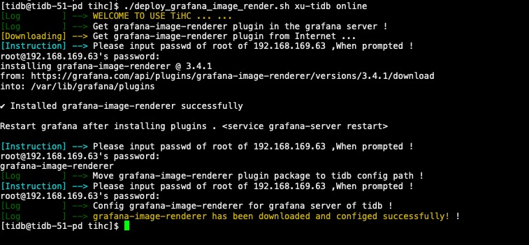
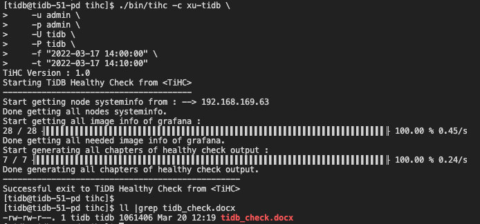

# TiHC
&nbsp;&nbsp;&nbsp;&nbsp;&nbsp;&nbsp;&nbsp;TiHC (TiDB Healthy Check) 是一个开源的、基于 rust 构建的 TiDB 巡检工具，目的是为缩短询价时间，提高交付效率。与传统 Oracle、MySQL 等巡检工具使用 SQL 采集对应内存表、操作系统指标，最终生成 Html 巡检报告不同。因为 TiDB 排查问题的方法论基于 Grafana 监控指标构建，tihc 借鉴 TiDB 官方工具 tiup 分发 ssh 的原理，分布式采集各节点信息并整合 grafana 监控，最终生成可交付的巡检 Office Doc 文件。

&nbsp;&nbsp;&nbsp;&nbsp;&nbsp;&nbsp;&nbsp;**TiHC 的作用 ：**    
&nbsp;&nbsp;&nbsp;&nbsp;&nbsp;&nbsp;&nbsp;1. 对于 TiDB DBA 角色，节约 TiDB 巡检过程中大量可模版化工作；    
&nbsp;&nbsp;&nbsp;&nbsp;&nbsp;&nbsp;&nbsp;2. 对于 Others DBA 角色，提供一套针对 TIDB 健康检查的简单方法；      

&nbsp;&nbsp;&nbsp;&nbsp;&nbsp;&nbsp;&nbsp;**Tips ：** TiHC 不期望探究所有性能细节，仅关注 TiDB 读写请求流中较为常见、重要的组件监控进行采集与分析。详细的根因分析还是需 Grafana 各组件配合分析、定论。
# Features

* **采集 grafana 监控面板**    
&nbsp;&nbsp;&nbsp;&nbsp;&nbsp;&nbsp;&nbsp;调用 grafana-image-render 插件，获取指定时间段内的监控信息。   

* **生成 Docx 巡检文档**    
&nbsp;&nbsp;&nbsp;&nbsp;&nbsp;&nbsp;&nbsp;TiHC 将收集的统计数据排版、生成 Office Word 文档模版，仅需少量修改便可直接交付客户。      

* **轻量化巡检采集操作**      
&nbsp;&nbsp;&nbsp;&nbsp;&nbsp;&nbsp;&nbsp;TiHC 只需初次巡检时，配置 Grafana-image-render。此后，仅需要可执行文件便可完成全部巡检。    


# Documents  

* 更多细节相见 [TiHC Wiki](https://github.com/jansu-dev/tihc/wiki#welcome-to-the-tihc)。

# Quick start
## 1. TiHC 使用简介


&nbsp;&nbsp;&nbsp;&nbsp;&nbsp;&nbsp;&nbsp;TiHC 遵循 terminal cli 使用风格，可 --help 或 -h 查看使用方法。
```shell
$ tihc % ./bin/tihc -h
TiHC 1.0
Jan Su
TiHC (TiDB Healthy Check) is a tool designed by RUST to reduce inquiry time and improve delivery efficiency.

USAGE:
    tihc [OPTIONS]

FLAGS:
    -h, --help       Prints help information
    -v, --version    Print TiHC version

OPTIONS:
    -c <cluster_name>              The name of cluster which need to health check.
    -t <grafana_end_time>          The TSO of grafana end time which need to get images.
    -p <grafana_pwd>               Use password of target grafana. (default "admin")
    -f <grafana_start_time>        The TSO of grafana start time which need to get images.
    -u <grafana_user>              Use user name of target grafana. (default "admin")
    -P <ssh_pwd>                   The password to login via SSH with "ssh_user".
    -U <ssh_user>                  The user name to login via SSH.
```

该工具在获取 Grafana 监控面板图像部分，借用了 grafana-image-renderer 插件,具体使用方法参考 [Grafana Image Renderer](https://grafana.com/grafana/plugins/grafana-image-renderer/)  的 `Run as standalone Node.js application` 部分。


## 2. TiHC 源码编译
&nbsp;&nbsp;&nbsp;&nbsp;&nbsp;&nbsp;&nbsp;在本地安装 Rust 环境下，访问 tihc repo 直接获取源码至本地。使用 make 命令便可编译二进制文件。

```bash
# Get repo from github
git clone git@github.com:jansu-dev/tihc.git && cd tihc

# Build the tool by Makefile
make

# Get binary of tihc
ll ./bin/tihc
```


## 3. TiHC 快速巡检

### 3.1 本地安装

&nbsp;&nbsp;&nbsp;&nbsp;&nbsp;&nbsp;&nbsp; 下面仅介绍 online 下载方式部署 grafana-image-render，至于 offline 方式请参考 [Wiki 描述](https://github.com/jansu-dev/tihc/wiki/Quick-start#2离线安装-grafana-image-render)，部署过程中遇到的问题请参考 [Wiki FAQ](https://github.com/jansu-dev/tihc/wiki/FAQ#tihc-faq)。
```shell
curl -O https://github.com/jansu-dev/tihc/blob/master/deploy_grafana_image_render.sh && \
chmod 777 ./deploy_grafana_image_render.sh && \
./deploy_grafana_image_render.sh CLUSTER_NAME online
```
&nbsp;&nbsp;&nbsp;&nbsp;&nbsp;&nbsp;&nbsp; 执行成功后，屏幕输出如下：    

&nbsp;&nbsp;&nbsp;&nbsp;&nbsp;&nbsp;&nbsp;

### 3.2 执行采集

&nbsp;&nbsp;&nbsp;&nbsp;&nbsp;&nbsp;&nbsp;使用一下命令执行巡检，详情见 [TiHC Wiki Quick Start](https://github.com/jansu-dev/tihc/wiki/Quick-start#quick-start) 部分。

```shell
./bin/tihc -c xu-tidb \
    -u admin \
    -p admin \
    -U tidb \
    -P tidb \
    -f "2022-03-17 14:00:00" \
    -t "2022-03-17 14:10:00"
```

&nbsp;&nbsp;&nbsp;&nbsp;&nbsp;&nbsp;&nbsp;当巡检命令发出后 terminal 输出如下，并且会在 tihc 可执行文件目录下找到的名为 `tidb_check.docx` 的文件。

&nbsp;&nbsp;&nbsp;&nbsp;&nbsp;&nbsp;&nbsp;

# Releases

&nbsp;&nbsp;&nbsp;&nbsp;&nbsp;&nbsp;&nbsp;TiHC 的发行是在 github 上完成。