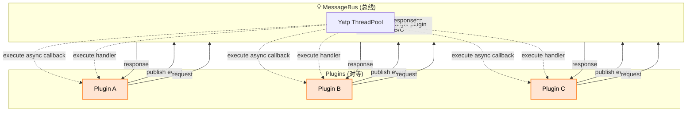

# 📘 TiDB Intelligent Health Check (tihc) — Architecture Design Document

---

## 1️⃣ 项目定位与目标

`tihc` 是一个为 DBAs 提供的 CLI + Web 集成工具平台，支持 TiDB 集群检测、慢查询分析、DDL 检查等多种插件扩展能力。  
平台采用微内核架构，所有业务逻辑均以插件形式扩展，**microkernel 核心**只负责插件调度、生命周期管理、服务注册与统一消息总线驱动通信。

---

## 2️⃣ 架构核心原则

| Layer           | Pattern/Approach                    | Description       |
| --------------- | ----------------------------------- | ----------------- |
| Microkernel     | Microkernel Architecture + Service Registry + Message Bus            | 插件调度/生命周期/接口管理，microkernel 不参与具体业务逻辑。插件通信通过 ServiceRegistry + MessageBus 解耦，实现高扩展性。 |
| Plugin Design   | DDD + Clean Architecture            | 插件即有界上下文，采用 DDD 分层（domain/application/infrastructure），每个插件独立建模、独立测试。 |
| Startup Mode    | CLI + Web Server                    | 单一二进制包，支持自包含部署，所有入口适配（参数校验、权限、日志、错误处理等）统一放在 backend/cli 层，plugin 层只关注业务逻辑和命令注册。 |

---

## 3️⃣ Overall Architecture Diagram (Logical View)

```
+-----------------------------------------------------+
| CLI / Web Server Entry Point |
+-----------------------------------------------------+
| 🌐 Microkernel Platform |
| +-----------------------------------------------+ |
| | Microkernel Services | |
| | - ConfigService | |
| | - LoggingService (tracing) | |
| | - DatabaseService (SQLx) | |
| | - MetricsService (Prometheus) | |
| | - MessageBus (统一消息总线: Pub/Sub + Request/Reply)|
| | - ServiceRegistry (Plugin Service Registry) | |
| +-----------------------------------------------+ |
| | Plugin Management (PluginManager) | |
| | - Plugin discovery/loading/lifecycle mgmt | |
| | - Plugin hot-reload (future) | |
| +-----------------------------------------------+ |
+-----------------------------------------------------+
| 📦 Plugin System (DDD Context) |
| Plugin = Bounded Context, each plugin encapsulates its own domain and services |
| +-------------------------------------------------+ |
| | LossyDDLChecker | Diagnose lossy DDL risks | |
| | SlowLogParser | Parse slow.log and import | |
| | GitHubIssueTracker | GitHub issue mapping | |
| | RCAEngine | Root cause analysis (AWR/ADDM) | |
| | SQL Editor | Visual SQL editor | |
| | ProfileCollector | Profile & metrics capture | |
| | AlertWebhook | Alert push & config | |
| +-------------------------------------------------+ |
+-----------------------------------------------------+
| 🧠 DDD Layer Structure in Each Plugin |
| +-----------------------------------------------+ |
| | domain | Domain model/rules/entities/events| |
| | application | Use case layer/domain service coordination | |
| | infrastructure | DB/HTTP/Prometheus implementation| |
| +-----------------------------------------------+ |
+-----------------------------------------------------+
| 📡 External Dependencies/Data Sources (Unified Adapter) |
| +-------------------------------------------------+ |
| | SQLx + TiDB / MySQL / PG | |
| | DuckDB embedded analytics DB | |
| | Prometheus / Grafana HTTP API | |
| | profile API capture (tidb/tikv/pd/ticdc) | |
| +-------------------------------------------------+ |
```
---

## 4️⃣ Plugin Communication Mechanism

### ✅ 1. Inter-plugin Calls: ServiceRegistry + Dependency Inversion

- **插件 A** 定义并实现 trait 接口（如 `DdlCheckerService`）并注册到 `ServiceRegistry`。  
- **插件 B** 通过 `registry.resolve::<dyn DdlCheckerService>()` 调用服务，实现插件间解耦。  

> 💡 优点：插件之间只依赖接口而非具体实现，方便扩展、替换和测试。

---

### 📡 2. Unified Message Bus: Pub/Sub + Request/Reply

`MessageBus` 是 microkernel 的通信总线（**总线中心化设计**），负责插件间消息路由与异步任务调度。**整个通信系统是完全异步的**，不支持同步执行。  

#### 🔹 Pub/Sub（订阅/发布）

- 插件主动订阅感兴趣的主题，实现 **异步广播**，解耦插件扩展。  
- **不返回值**，接收者只处理事件。  
- **典型用途**：状态变更、告警推送、诊断结果广播。  
- **执行方式**：通过 **Yatp ThreadPool** 异步调度订阅插件逻辑，发布者无需等待。  

#### 🔹 Request/Reply（请求/响应）

- 插件间支持 **点对点异步请求/响应**。  
- **必须有返回值**，请求方通过异步任务获取结果。  
- **典型用途**：命令执行、数据请求、插件间 RPC 调用。  
- **执行方式**：请求和响应都通过 **Yatp ThreadPool** 异步处理，无同步阻塞。

---

### 3. MessageBus 示例接口

```rust
/// Plugin communication message.
pub struct PluginMessage {
    pub topic: String,
    pub payload: serde_json::Value,
}

/// Trait for the microkernel MessageBus.
pub trait MessageBus: Send + Sync {
    /// Publish a message to the bus (broadcast only, no return).
    fn publish(&self, msg: PluginMessage);

    /// Subscribe to a topic; receives all matching messages asynchronously.
    fn subscribe(&self, topic: &str, handler: Arc<dyn Fn(&PluginMessage) + Send + Sync>);

    /// Send request and await response (Request/Reply, async only).
    fn request(&self, topic: &str, payload: serde_json::Value) -> anyhow::Result<serde_json::Value>;
}
```

### 4. Plugin Communication Flow (完全异步、总线中心化)

MessageBus 底层实现技术 : 线程池调度：yatp, 所有插件逻辑通过 Yatp ThreadPool 执行，负责异步任务调度和插件逻辑执行。



## 5️⃣ Plugin Directory Structure (Example)

```
plugin-lossy-ddl/
├── domain/
│   ├── rule.rs
│   └── model.rs
├── application/
│   └── lossy_ddl_service.rs
├── infrastructure/
│   └── parser_adapter.rs
├── plugin.rs        // Plugin trait implementation + registration
├── lib.rs

```
### Plugin Registration Example

```
pub struct LossyDdlPlugin;

impl Plugin for LossyDdlPlugin {
    fn name(&self) -> &str { "lossy_ddl" }

    fn register(&mut self, ctx: &mut PluginContext) {
        ctx.register_command("check-lossy-ddl", LossyDdlHandler);
        ctx.service_registry.register::<dyn DdlCheckerService>(Arc::new(LossyDdlServiceImpl));

        // Optional: subscribe to relevant events
        ctx.message_bus.subscribe("ddl_event", Arc::new(|msg| {
            println!("Received DDL event: {:?}", msg);
        }));
    }
}

```

## 6️⃣ Backend Key Technology Choices

| Module             | Technology                       | Reason          |
| ------------------ | -------------------------------- | --------------- |
| Web Framework      | `axum` + `tower`                 | 高性能、可组合的 Web 框架 |
| ORM                | `sqlx`                           | 零运行时开销，异步支持     |
| Local Analytics DB | `DuckDB`                         | 支持复杂 OLAP 查询    |
| Config Mgmt        | `config` + `serde`               | 支持多源配置          |
| Logging            | `tracing`, `anyhow`, `thiserror` | 可靠的诊断工具         |
| Metrics            | `prometheus-client`              | 内部监控与可视化        |
| Plugin Mgmt        | 自定义 PluginManager + trait        | 可控的插件生命周期       |
| API Comm           | JSON REST API + `reqwest`        | 易于集成（如 Grafana） |

## 7️⃣ Frontend Architecture (Vue 3 + TS)

### 🧱 Tech Stack

| Technology      | Purpose                          |
| --------------- | -------------------------------- |
| Vue 3           | UI 框架                            |
| Vite            | 构建工具                             |
| TypeScript      | 静态类型                             |
| Pinia           | 状态管理                             |
| Axios           | HTTP 客户端                         |
| Naive UI        | 高质量 UI 组件库                       |
| ECharts         | 数据可视化与图表                         |
| Vue Naive Admin | Vue 3 + Naive UI 后台管理模板，快速构建管理界面 |

### 📄 Page Modules
| Page                 | Functionality |
| -------------------- | ------------- |
| Dashboard            | 概览与状态面板       |
| Slow Log Analysis    | 查询/导入/聚合视图    |
| DDL Safety Check     | 检查 SQL 变更风险   |
| SQL Editor           | 执行/历史管理       |
| Profile Collection   | Flamegraph 显示 |
| Webhook Alert Config | 设置推送通道和规则     |


## 8️⃣ CLI Command Design

```
# CLI mode diagnosis
tihc check lossy-ddl --file ddl.sql

# Start Web service + UI
tihc web --port 8080

# Plugin related
tihc plugin list
tihc plugin run slowlog-parser --file slow.log

```

## 9️⃣ Testing Strategy

```
| Layer              | Test Approach                         |
| ------------------ | ------------------------------------- |
| Domain             | Unit tests                            |
| Application        | Use case combination tests            |
| Interface          | HTTP/CLI interface tests              |
| Plugin Integration | Plugin load/invoke tests              |
| Core Platform      | PluginManager & ServiceRegistry tests |

```


