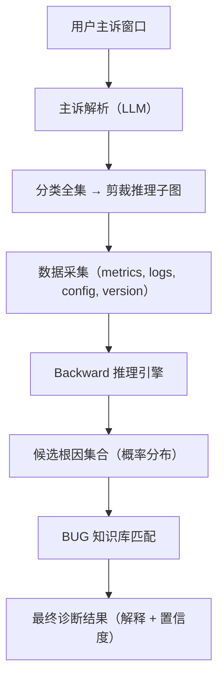

# 根因分析引擎设计文档（优化版）

---

## 1. 总体目标

**输入**：用户主诉（自然语言，含指标与时间范围）

**核心方法**：基于结构因果模型（SCM）与不确定性处理（Uncertain），从观测到的异常指标出发，逆向推理可能的根因集合（概率化、排序输出）。

**输出**：
- 根因候选（按概率排序）
- 因果链条解释
- 已知 BUG 匹配

---

## 2. 系统架构

---

## 3. Backward 推理流程

### 3.1 输入
- 异常指标：主诉中提取的指标
- 时间范围：主诉中提取的时间窗
- 相关数据：metrics / logs / config / version

### 3.2 推理步骤
1. **起点确定**：在因果图中定位异常指标节点（如 SQL_Duration）。
2. **逆向遍历**：沿因果边回溯（如 SQL_Duration ← CPU_Load ← Disk_IO）。
3. **不确定性传播**：
   - 数据缺失 → Uncertain::Missing
   - 异常尖刺 → Uncertain::Outlier
   - 贝叶斯更新概率
4. **剪枝**：仅在主诉分类相关子图推理，避免全局爆炸。
5. **输出**：根因节点 + 概率分布 + 路径解释

---

## 4. 主诉解析与推理裁剪

### 4.1 主诉解析示例
- “查询延迟升高” → 指标: SQL_Duration，范围: 最近 2 小时
- “TiKV 节点抖动” → 指标: Store_QPS, Store_Duration，范围: 最近 1 天

### 4.2 分类全集（用于剪裁）
- 资源类：CPU、内存、IO、网络
- 配置类：系统变量、参数
- SQL/事务类：锁冲突、写放大
- 存储引擎类：Compaction、Ingest、GC
- 调度类：Region balance、Leader transfer
- 外部依赖类：K8s、硬件
- 已知 BUG 类

分类结果决定 SCM 剪裁的子图范围。

---

## 5. 不确定性处理（Uncertain）

- 缺失点：Uncertain::Missing，降低置信度
- 尖刺点：Uncertain::Outlier，单次异常不视为根因
- 概率融合：贝叶斯规则传播到根因分布
- 输出：根因候选附带置信区间

---

## 6. BUG 知识库

Backward 推理结果再经过 pattern 匹配：
- 大量 L0 文件 + 写入放缓 → BUG#1234: L0 Ingest Regression
- GC worker 延迟 + 特定版本 → BUG#5678: GC Stall

实现“观测 → 因果链 → BUG”串联。

---

## 7. 输出示例

**主诉**: 查询延迟升高  
**时间**: 最近 2 小时

**推理结果**:
- 根因候选
    - CPU 饱和（P=0.65, CI=±0.1）
    - Disk IO 抖动（P=0.20, CI=±0.05）
    - GC 延迟异常（P=0.10, CI=±0.03）
- BUG 匹配
    - 无匹配
- 因果链
    - CPU_Load → SQL_Duration
    - Disk_IO → SQL_Duration

---

## 8. 后续扩展

- 多指标主诉（组合 backward）
- 多模态输入（metrics+logs）
- BUG 库在线更新
- 结果验证（peer comparison）
